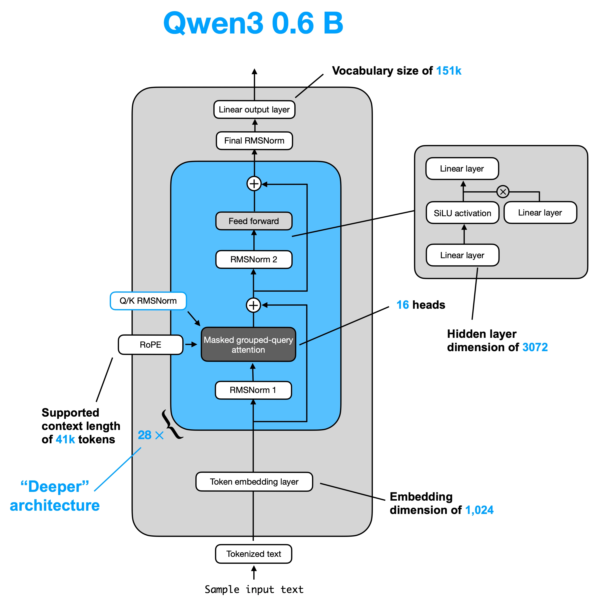
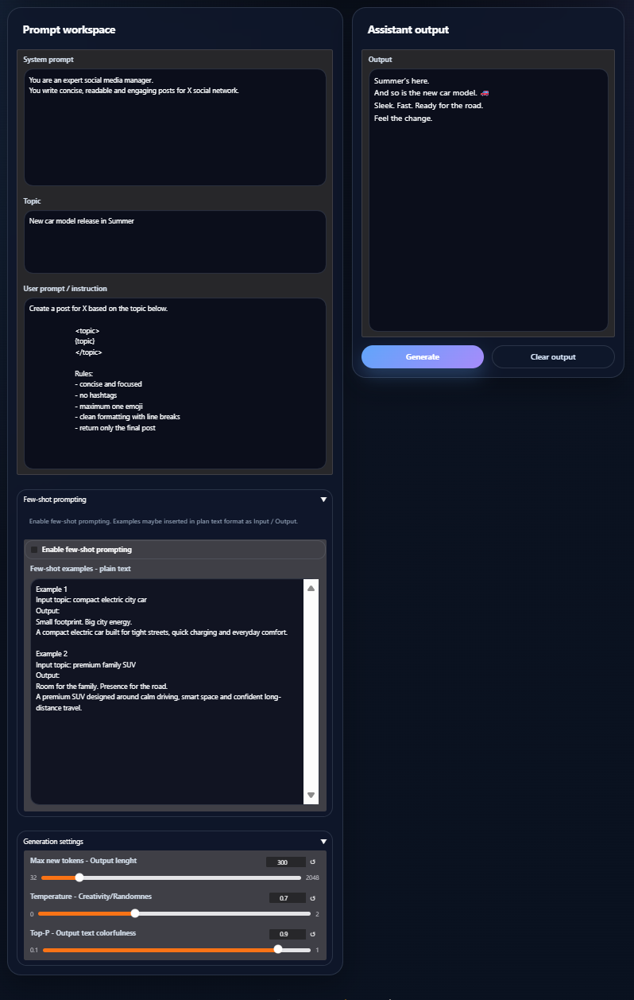

# AI prompt simulator 

```text
https://gitlab.com/nyx3ton-group/nyx3ton-project/-/blob/main/AI-agents-workflows-course/chapter-1-ai-workflows-openvino-gradio.ipynb

```

- Architektura bezi na OpenVINO.
- Podporuje upravy MAX_INPUT_TOKENS, TOP_P a TEMPERATURE v Gradio UI
- Podporuje Zero-shot, Few-Shot, User and System Prompt
- Podporuje viacpolozkovy Web Scrapping cez BeautifulSoup (non-JavaScript Web URLs)


```text
Lokalne modely pre ktore bol skrpit testovany su:

Qwen/Qwen3-0.6B
https://huggingface.co/Qwen/Qwen3-0.6B

Qwen/Qwen3-4B-Instruct-2507
https://huggingface.co/Qwen/Qwen3-4B-Instruct-2507

```



Povinne kniznice:

```text
!python -m pip install --upgrade torch --index-url https://download.pytorch.org/whl/cpu
!python -m pip install --upgrade openvino optimum-intel transformers accelerate safetensors sentencepiece huggingface_hub requests python-dotenv gradio
```

## 1. Konfiguracia

Odporucane pre RTX 4070 Super 12GB:

```env

Priecinky pre lokalne behy modelov:

HF_CACHE_DIR = os.getenv("HF_CACHE_DIR", "./hf_cache")
OV_MODELS_DIR = os.getenv("OV_MODELS_DIR", "./ov_models")
OV_CACHE_DIR = os.getenv("OV_CACHE_DIR", "./ov_cache")

Nastavenie zariadenia:

OPENVINO_DEVICE = os.getenv("OPENVINO_DEVICE", "CPU")

Vychodiskoive nastavenia modelu (mozna zmena z Gradio UI)

MAX_INPUT_TOKENS = int(os.getenv("MAX_INPUT_TOKENS", "2048"))
MAX_NEW_TOKENS = int(os.getenv("MAX_NEW_TOKENS", "300"))
TEMPERATURE = float(os.getenv("TEMPERATURE", "0.7"))
TOP_P = float(os.getenv("TOP_P", "0.9"))

Vynutenie behu modelku z lokalneho priecinku:

OFFLINE_MODE = os.getenv("LOCAL_FILES_ONLY", "1").strip().lower() in {"1", "true", "yes", "y"}
FORCE_HF_FALLBACK = os.getenv("FORCE_HF_FALLBACK", "0").strip().lower() in {"1", "true", "yes", "y"}

```

### 2. Priklad vystupu z modelu

Menu s outputom:




