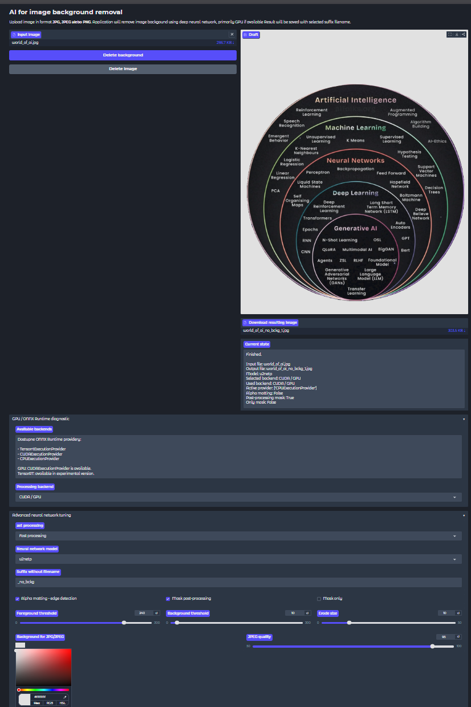

## AI Background Remover

```text
Tato aplikacia sluzi na automaticke odstranenie pozadia z obrazkov vo formatoch JPG, JPEG a PNG. Pouziva neuronovu siet cez kniznicu `rembg`, ONNX Runtime a Gradio frontend. Ak je dostupna NVIDIA GPU akceleracia, aplikacia vie pouzit `CUDAExecutionProvider`, pricom CPU zostava ako fallback.

Pouzivatel nahra obrazok cez jednoduche webove rozhranie, vyberie model a volitelne doladi parametre spracovania, ako alpha matting, prahy masky, erozia okrajov alebo post-processing. Vysledny subor sa ulozi do priecinka `output_images` v rovnakom formate ako vstupny subor a s upravenym nazvom, napriklad `obrazok_bez_pozadia.png`.

```


## 1. Hlavne funkcie

```text
• nahratie obrazka vo formate JPG, JPEG alebo PNG
• odstranenie pozadia pomocou neuronovej siete
• podpora GPU akceleracie cez ONNX Runtime CUDA
• vyber viacerych modelov `rembg`
• pokrocile ladenie masky a okrajov objektu
• ulozenie vysledku v rovnakom formate
• automaticke upravenie nazvu vystupneho suboru
• Gradio webove rozhranie s nahladom a moznostou stiahnutia vysledku

```

## 2. Ako funguje pipeline: 

```text

Vstupny obrazok JPG/JPEG/PNG
        |
        v
Gradio frontend
        |
        v
Kontrola formatu suboru
        |
        v
Nacitanie obrazka cez Pillow
        |
        v
EXIF transpose + konverzia na RGBA
        |
        v
Vyber modelu rembg
        |
        v
Vyber backendu ONNX Runtime
        |
        +--> CUDA / GPU, ak je dostupna
        |
        +--> CPU fallback
        |
        v
Odstranenie pozadia neuronovou sietou
        |
        v
Alpha matting / post-processing masky
        |
        v
Ulozenie vystupu
        |
        +--> PNG: transparentne pozadie
        |
        +--> JPG/JPEG: zvolene pozadie, napr. biele
        |
        v
Premenovanie suboru so suffixom _bez_pozadia
        |
        v
Nahlad a stiahnutie vysledku v Gradio UI

```

### 3. Priklad vystupu z modelu

Uvodne menu:


