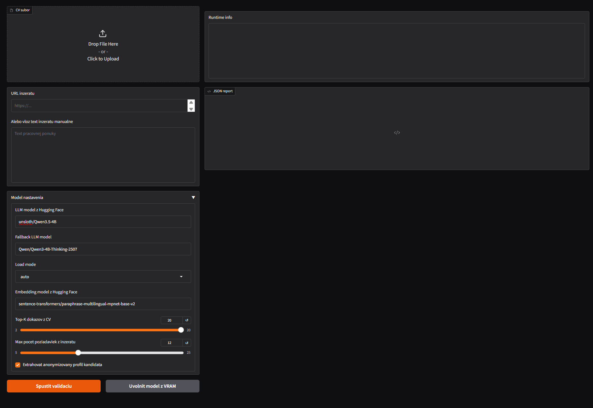
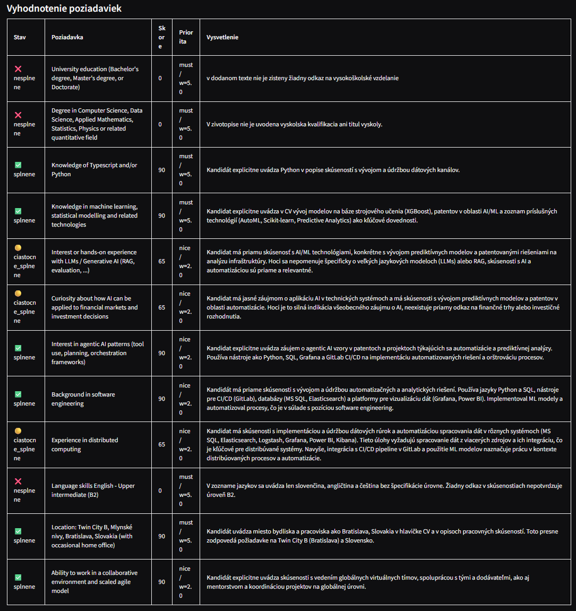

# AI CV Validator 

Momentalne je architektura vo faze "zero shot".

## 1. Konfiguracia

Odporucane pre RTX 4070 Super 12GB:

```env

LLM_MODEL_ID=unsloth/Qwen3.5-4B
FALLBACK_LLM_MODEL_ID=Qwen/Qwen3-4B-Thinking-2507
EMBED_MODEL_ID=sentence-transformers/paraphrase-multilingual-mpnet-base-v2
LLM_LOAD_MODE=auto
MAX_GPU_MEMORY=10.5GiB

```

## 2. Ako funguje pipeline (pre zero-shot model)

```text

CV + URL/text inzeratu (Gradio frontend)
        |
        v
Extrakcia textu
        |
        v
LLM extrahuje poziadavky z inzeratu
        |
        v
CV sa rozdeli na chunky
        |
        v
Embedding model vytvori FAISS index
        |
        v
Ku kazdej poziadavke sa najdu dokazy z CV
        |
        v
LLM vyhodnoti poziadavku z odkazov
        |
        v
Report + JSON vystup

```

## 3. Podporovane dokumenty
```text

• PDF cez PyMuPDF
• DOCX cez python-docx
• RTF cez striprtf
• TXT/MD priamo
• DOC legacy cez Microsoft Word COM fallback, ak je nainstalovany Word + pywin32

```

### 4. Priklad vystupu z modelu

Prve spustenie:



Priklad vyhodnoteneho zivotopisu a poznamky k poziadavkam:

