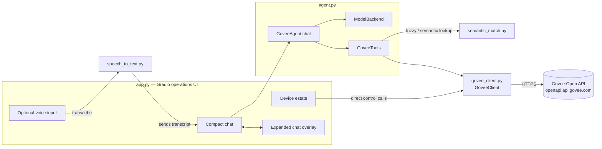
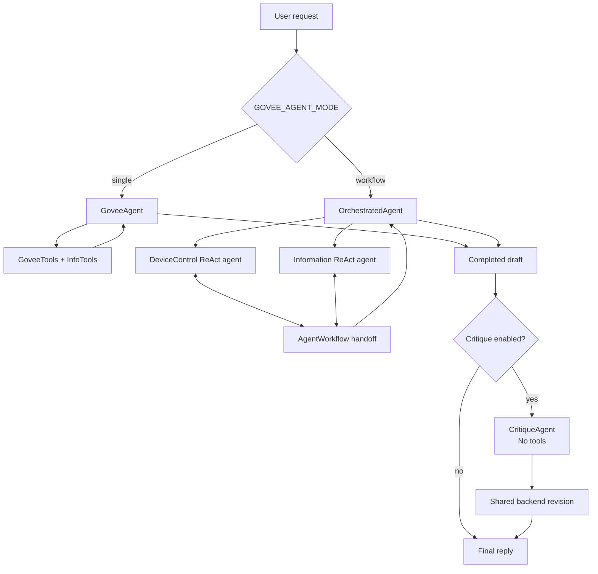
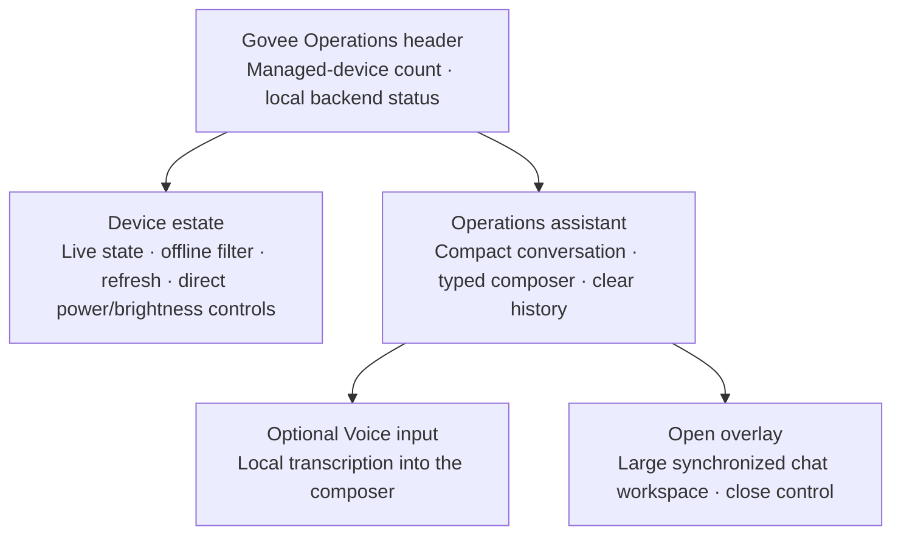
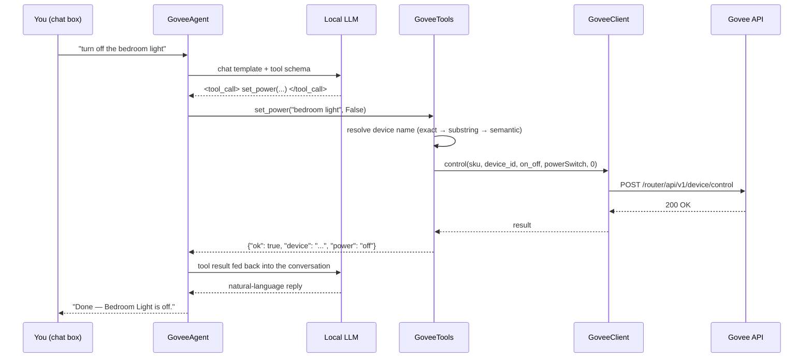
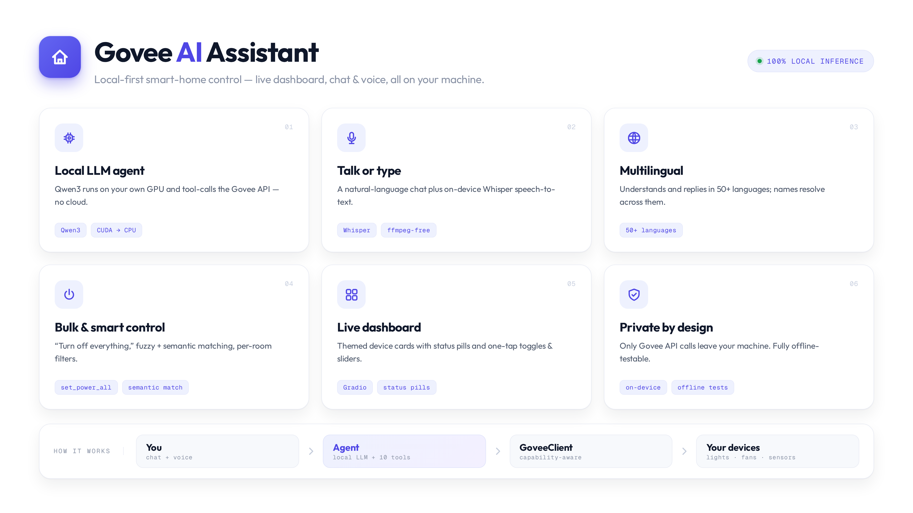

# Govee AI Assistant

A local dashboard and chat assistant for [Govee](https://www.govee.com/) smart
home devices. A [Gradio](https://www.gradio.dev/) web UI shows live device
status and lets you control devices directly, while a **locally-run LLM**
acts as a tool-calling agent that can look up and control the same devices
through natural language — no data leaves your machine except the Govee API
calls themselves.

```
"turn off the christmas lights and set the bedroom lamp to 30% warm white"
```

The assistant resolves device names (including fuzzy/semantic matches),
checks what each specific device actually supports, and calls the Govee API
directly — all through a small, dependency-light Python stack.

## Contents

- [Why this exists](#why-this-exists)
- [Features](#features)
- [Architecture](#architecture)
  - [Agent topology](#agent-topology)
  - [Visual interface](#visual-interface)
- [How each component works](#how-each-component-works)
  - [govee_client.py](#govee_clientpy)
  - [semantic_match.py](#semantic_matchpy)
  - [speech_to_text.py](#speech_to_textpy)
  - [agent.py](#agentpy)
  - [Weather, news & memory](#weather-news--memory)
  - [app.py](#apppy)
  - [Tests and CLI utilities](#tests-and-cli-utilities)
- [Project structure](#project-structure)
- [Installation](#installation)
- [Configuration](#configuration)
- [Running it](#running-it)
- [Supported controls](#supported-controls)
- [Testing](#testing)
- [Troubleshooting](#troubleshooting)
- [Roadmap](#roadmap)
- [Cheatsheet](#cheatsheet)
- [License](#license)

## Why this exists

Govee's own app and cloud integrations work fine, but there's no
official way to say *"turn off whatever's on in the bedroom"* and have it
figure out what that means. This project adds that layer, entirely locally:

- **No cloud LLM.** The model that interprets your requests runs on your own
  GPU (or CPU as a fallback) — only the Govee API calls themselves
  leave the machine.
- **Capability-aware, not hardcoded.** Every device advertises its own
  capabilities (a fan and a light strip support completely different
  controls); the tool layer reads that per-device instead of assuming a
  fixed feature set.
- **Forgiving about names.** "the wifi sensor" or "the lamp in the bedroom"
  can resolve to the right device even without an exact name match — but it
  won't guess between two genuinely similar devices.

## Features

- **Live dashboard** — every device on your account, current state
  (power / brightness / color temp / online status / sensor readings),
  refreshed on load, on demand, and after each chat turn.
- **Operations-focused UI** — a lean, dark/light-aware operations dashboard
  with a device estate panel, compact status chips, direct controls, and an
  assistant workspace. The **Offline** filter keeps the device list focused,
  and **Open overlay** launches a large chat workspace without losing the
  dashboard or conversation history.
- **Natural-language control** — a local LLM plans and executes Govee API
  calls via a small, explicit tool set (power, bulk on/off for many devices
  at once, brightness, RGB color, color temperature, scenes, toggles, fan
  speed).
- **Two agent architectures** — the default single tool-calling agent, or an
  opt-in **LlamaIndex multi-agent workflow** (`GOVEE_AGENT_MODE=workflow`) with
  a device-control agent and an information agent that hand off to each other.
- **Optional writer–critic refinement** — after an answer is complete, a
  tool-free critic reviews it and the writer can make one bounded revision.
  It is off by default, so routine device commands stay responsive.
- **CUDA → CPU fallback** — loads the model on CUDA when available and falls
  back to plain CPU inference if CUDA loading fails.
- **Semantic device/scene matching** — a lightweight local embedding
  model resolves descriptive or approximate names when an exact match
  isn't found, and stays conservative when a request is genuinely
  ambiguous rather than guessing.
- **Multilingual** — the embedding model is multilingual (50+ languages),
  so a request in French, Spanish, German, etc. can still resolve to a
  device named in English, and the LLM is instructed to reply in whatever
  language the user wrote in.
- **Speech-to-text** — an optional **Voice input** panel records and
  transcribes speech with a local, multilingual Whisper model. The transcript
  is placed in the composer for review before it follows the same chat/tool
  path as typed control.
  Recordings are decoded in-process (stdlib `wave` + numpy), so voice works
  **without ffmpeg installed** in the common case.
- **Automatic unit correction** — Govee's sensor API reports temperature
  in Fahrenheit with no unit field; this is normalized to Celsius once, at
  the source.
- **Fully offline-testable** — the device-resolution and tool-dispatch
  logic, and the entire Gradio UI wiring, can be tested with zero network
  calls and zero model loading via fake/stub doubles.
- **Defensive by design** — every tool call is wrapped so a bug in one
  tool can't crash the whole conversation; capability checks return a
  clear error instead of guessing at what a device can do.

## Architecture



Each layer only knows about the one below it: `app.py` never talks to the
Govee API directly except through `GoveeClient`, and `agent.py` never talks
to Gradio at all. This is also why the whole thing is testable without a
network connection or a loaded model — every layer's dependency is a
[`typing.Protocol`](https://docs.python.org/3/library/typing.html#typing.Protocol)
(a structural interface), so a fake object with the right methods can stand
in for the real thing in tests.

### Agent topology

Only one **writer path** is selected at startup. The optional critic wraps the
selected writer after it has completed any tool work; it is not a second
controller and cannot issue device commands.

| Component | Enabled by | Responsibility | Tool access |
|---|---|---|---|
| `GoveeAgent` | `GOVEE_AGENT_MODE=single` (default) | Runs the project’s bounded generate → tool → observe loop for device, weather, news, and memory requests. | `GoveeTools` + `InfoTools` |
| `OrchestratedAgent` | `GOVEE_AGENT_MODE=workflow` | Drop-in wrapper around the LlamaIndex multi-agent workflow. | Delegates to specialists |
| `DeviceControl` ReAct agent | Workflow mode | Handles Govee device inspection and control, including bulk power changes. | `GoveeTools` |
| `Information` ReAct agent | Workflow mode | Handles weather, news, article extracts, and long-term memory. | `InfoTools` |
| `CritiqueAgent` | `GOVEE_CRITIQUE_ENABLED=true` | Reviews only the completed natural-language draft for accuracy, clarity, and safety; its shared backend creates a bounded rewrite only when feedback is needed. | None |
| `WriterCriticAgent` | `GOVEE_CRITIQUE_ENABLED=true` | Wraps the selected writer, applies up to `GOVEE_CRITIQUE_MAX_PASSES` passes, and replaces the final chat-history entry with the refined reply. | Inherits writer; critic remains tool-free |

`ModelBackend` and `GemmaLocalLLM` are shared local-model adapters, not
separate agents: they keep one model loaded while serving the selected writer
and, when enabled, the critic.



The default path is deliberately the simplest and fastest. Workflow mode
adds specialist handoffs for broader tasks; critic mode adds a final response
quality pass. Neither feature changes the direct dashboard controls, which
continue to call `GoveeClient` without involving an LLM.

### Visual interface

The Gradio frontend is designed as an operations console rather than a
consumer chat page: device state and direct actions remain visible, while a
larger workspace is available when a conversation needs more room.



The compact and overlay chat views share the same `gr.State` history. Messages
sent from either view appear in both, and clearing the conversation clears
both views. The overlay is a CSS-backed workspace inside the app, not browser
fullscreen, so users can close it immediately and return to the device estate.

### Request flow (chat)



If the model isn't confident about a device or its capabilities, the system
prompt instructs it to call `list_devices` or `get_device_state` first
rather than guess — the tool schema and prompt work together on this.

## How each component works

### govee_client.py

The Govee API wrapper. A thin, typed client around Govee's **Open API v2**
(the current capability-based API, not the older flat turn/brightness/color
model).

| | |
|---|---|
| Base host | `https://openapi.api.govee.com` |
| Auth | `Govee-API-Key` header |
| Rate limit | 10,000 requests / account / day |

Key pieces:

- **`Capability`** — a dataclass mirroring one entry from Govee's device
  capability list (`type`, `instance`, and a `parameters` blob describing
  whether it's an `ENUM`, `INTEGER` range, or nested `STRUCT`). Exposes
  `.options` and `.value_range` as convenience properties.
- **`Device`** — a dataclass for one physical device, holding its full raw
  capability list plus `.capability(type, instance)` and `.has(type,
  instance)` lookups. This is what lets every other layer ask "can this
  specific device do X?" instead of assuming.
- **`GoveeClient`** — the actual HTTP client:
  - `list_devices()` — `GET /router/api/v1/user/devices`, cached after the
    first call (pass `force_refresh=True` to bypass).
  - `get_state(sku, device_id)` — `POST /router/api/v1/device/state`,
    returns a flattened `{instance: value}` dict. **Converts
    `sensorTemperature` from Fahrenheit to Celsius here**, since Govee's
    API returns it unlabeled and in Fahrenheit — every consumer downstream
    gets Celsius automatically.
  - `control(...)` — the low-level `POST /router/api/v1/device/control`
    call; `set_power`, `set_brightness`, `set_color_rgb`, `set_color_temp`,
    and `set_scene` are typed convenience wrappers over it. `set_brightness`
    and `set_color_temp` clamp out-of-range values to the device's actual
    supported range before sending.
  - Raises `GoveeAPIError` (and the `GoveeRateLimitError` subclass for
    HTTP 429) with the parsed error message from Govee's response body.
- **`verify=`** constructor parameter accepts a path to a corporate CA
  bundle, for networks behind a TLS-inspecting proxy.

### semantic_match.py

Fuzzy name matching. A small, dependency-isolated module used as a
**fallback**, not a replacement, for exact/substring name matching
elsewhere in the project.

- Uses [`sentence-transformers`](https://www.sbert.net/)
  `paraphrase-multilingual-mpnet-base-v2` on CPU by default. It is loaded
  once, lazily, on first use and remains separate from the reasoning model.
  Being multilingual means a query in, say, French or Spanish embeds
  close to its English equivalent, so it can resolve device/scene names
  that are only ever stored in English. Override the model via the
  `GOVEE_EMBEDDING_MODEL` env var (e.g. back to the smaller English-only
  `all-MiniLM-L6-v2` if you only ever need English).
- **`best_match(query, candidates, threshold=0.45, margin=0.03)`** embeds
  the query and every candidate string, and returns the closest match only
  if it clears the similarity threshold *and* beats the runner-up by a
  clear margin. If two candidates are close enough to be genuinely
  ambiguous, it returns `None` rather than guessing — the caller is
  expected to fall through to an error asking for clarification.
- `encode_fn` is injectable, which is what makes this fully unit-testable
  without downloading the real model (see [Testing](#testing)).

### speech_to_text.py

Local speech-to-text, wired into the optional **Voice input** accordion in
`app.py`. Deliberately the same shape as `semantic_match.py`: one lazily
loaded model, one small public function, one injectable hook for offline
tests.

- Uses `transformers`' `automatic-speech-recognition` pipeline with
  **Whisper** (`openai/whisper-base` by default) — no new pip
  dependency, since `transformers`/`torch` are already required by
  `agent.py`.
- **No hard `ffmpeg` dependency.** Rather than handing the pipeline a file
  path (which makes transformers shell out to the external `ffmpeg` binary),
  the recording is decoded in-process with the standard-library `wave`
  module + numpy, downmixed to mono, resampled to 16 kHz (scipy's polyphase
  resampler when present, else a dependency-free linear fallback), and passed
  as a `{"raw": samples, "sampling_rate": 16000}` array. Since Gradio saves
  mic input as PCM WAV, this normally means voice works with **no ffmpeg
  installed at all**. Anything the stdlib decoder can't read falls back to the
  ffmpeg path if the binary is present, and `ffmpeg_available()` lets the UI
  warn clearly when it isn't.
- Passes `chunk_length_s=30` so recordings longer than Whisper's 30-second
  receptive field still transcribe (chunked long-form) instead of erroring,
  and quiets transformers' advisory log warnings once the model has loaded.
- Whisper auto-detects the spoken language across ~99 languages (a superset
  of the 50+ languages `semantic_match.py`'s embedding model covers), so
  voice input works in whatever language the rest of the pipeline
  understands, with no language selector needed. Override the model via
  `GOVEE_STT_MODEL`, e.g. `openai/whisper-base` (smaller/faster) or
  `openai/whisper-large-v3` (most accurate, but heavy on CPU).
- If short commands are repeatedly misheard, force the language with
  `GOVEE_STT_LANGUAGE`, e.g. `english`, `slovak`, `en`, or `sk`. Leave it
  empty for Whisper's automatic language detection.
- Speech-to-text device is controlled by `GOVEE_STT_DEVICE`: `auto`, `cpu`,
  or `cuda`. Docker defaults this to `cpu` so Whisper does not compete with
  Qwen for GPU memory; set it to `cuda` only if you have spare VRAM and want
  faster transcription.
- Recordings below `GOVEE_STT_SILENCE_RMS` are treated as silent before they
  reach Whisper, which avoids hallucinated transcripts from all-zero audio.
- **`transcribe(audio_path, transcribe_fn=None)`** never raises — a
  missing model, empty recording, or decode failure all just log and
  return `""`, the same conservative-by-default contract
  `semantic_match.best_match` uses, so a flaky mic can't crash the chat UI.
- In `app.py`, the transcribed text is submitted through the same `respond`
  path as typed chat, then device cards refresh so successful voice commands
  are visible immediately.

### agent.py

The local LLM and tool-calling agent — the core of the "AI" part. Three
main pieces:

**`ModelBackend`** — loads the configured local model (`GOVEE_LLM_MODEL`,
default [`unsloth/gemma-4-E4B-it`](https://huggingface.co/unsloth/gemma-4-E4B-it)) via `transformers`:

1. **CUDA** if `torch.cuda.is_available()`, with optional `bitsandbytes`
   4-bit/8-bit quantization (`QUANTIZE_BITS`) — 4-bit lets the 8B Gemma-4 fit
   a 12 GB GPU (~5–6 GB vs ~16 GB full precision).
2. **Plain CPU** (float32) if CUDA loading fails.
3. **Model-level fallback**: if the primary model can't be loaded at all
   (e.g. too large for the available VRAM *and* CPU load fails, or the repo
   is unavailable), `ModelBackend` retries with `GOVEE_FALLBACK_MODEL_ID`
   (e.g. the smaller `unsloth/Qwen3.5-2B`). `self.model_id` then reflects
   whatever actually loaded.

`.generate()` and the tokenizer expose the same interface regardless of which
model/backend loaded, so the tool-calling loop below doesn't need to know.

**`GoveeTools`** — the actual functions the LLM is allowed to call, each
wrapping `GoveeClient` with device resolution and capability checking:

| Tool | What it does |
|---|---|
| `list_devices` | Lists every device and what it can be controlled for |
| `get_device_state` | Current state of one device |
| `set_power` | Turn a device on/off |
| `set_power_all` | Turn **many** devices on/off in one call — "turn off everything", optionally filtered by type or room |
| `set_brightness` | Set brightness 1–100% |
| `set_color_rgb` | Set RGB color |
| `set_color_temp` | Set white color temperature (Kelvin) |
| `set_scene` | Activate a named preset scene |
| `set_toggle` | Turn a named toggle feature on/off (e.g. oscillation) |
| `set_fan_speed` | Set a fan to low/medium/high |
| `get_weather` | Current weather + short forecast for a location (or a configured default) |
| `get_news` | Recent headlines, optionally filtered by topic |
| `get_article_extract` | Full body-text extract of one article, given a headline's link |
| `recall_memories` | Semantic (RAG) recall of earlier chat turns, weather lookups, and news lookups |

Device names are resolved in three stages inside `_find_device`: **exact
match → unique substring match → semantic match** (via `semantic_match.py`).
An ambiguous or unresolvable name raises `DeviceNotFoundError`, which the
agent surfaces back to the model as a normal tool error rather than
crashing.

`set_fan_speed` is worth calling out specifically: Govee's `work_mode`
capability schema varies a lot between devices — some report named speed
levels ("Low"/"Medium"/"High"), others just plain numbered gears (1–8) with
no names at all. The implementation handles both shapes (and a flat integer
range) generically, mapping low/medium/high positionally when there's
nothing to match by name.

`set_power_all` is the one bulk tool: instead of making the model enumerate
devices and fire `set_power` once each (which a small local model tends to
get wrong or truncate), a request like *"turn off everything"* becomes a
single call. It accepts optional `device_type` (`light`/`fan`/`socket`/…)
and `name_contains` (e.g. `"bedroom"`) filters that combine with AND, skips
devices that can't be powered (sensors) instead of erroring, and tries each
device independently so one offline device can't abort the rest — returning
`changed` / `skipped` / `errors` lists for the model to summarise. The
system prompt explicitly steers the model to this tool for "all"/"everything"
/room-level requests.

**`build_tool_schema()`** describes the available tools in OpenAI-style function-schema
JSON. Qwen3's chat template supports this natively — passing `tools=` to
`tokenizer.apply_chat_template(...)` makes the model emit
`<tool_call>{"name": ..., "arguments": {...}}</tool_call>` blocks, which
`agent.py` extracts with a regex (`TOOL_CALL_RE`) and dispatches. No
external agent framework is needed for this single, well-defined local
tool surface.

**`GoveeAgent`** ties it together — `chat(user_message, history)` runs a
bounded loop (`max_tool_iters`, default 5): generate → check for tool calls
→ execute them → feed results back in → repeat until the model produces a
plain-text reply or the iteration budget runs out. `_call_tool` catches
*any* exception a tool raises (not just the expected ones) and turns it
into an error message for the model, so a bug in one tool can't take down
the whole conversation. This is the **default** agent — a single agent with
many tools.

### Writer–critic refinement — optional self-review

The project has room for the advanced ReAct pattern shown in the supplied
diagram, and implements a safe, bounded version of it. The normal writer
first completes its existing ReAct/tool loop: it reasons, uses a tool when
needed, observes the result, and produces a draft. Then `CritiqueAgent`
reviews that draft for factual accuracy, completeness, clarity, and safety.
If it finds a material issue, the shared local backend produces one revised
answer using that feedback; `WriterCriticAgent` returns the refined result.

The critic has **no tools** and runs only after the writer has finished its
tool calls. That design is intentional: a critique pass must never retry a
side-effecting operation such as switching a light or changing a fan speed.
Both roles reuse the one loaded Gemma model, so enabling it does not download
or keep a second 8B model in VRAM. It is a response-quality loop, not
autonomous fine-tuning or persistent self-modification.

Enable it with `GOVEE_CRITIQUE_ENABLED=true`; keep
`GOVEE_CRITIQUE_MAX_PASSES=1` unless you have a measured reason to add more
latency. Each pass adds one critic generation and, only when feedback is
needed, one revision generation. It wraps either `single` or `workflow` mode.

### orchestrator.py — optional multi-agent mode

Set `GOVEE_AGENT_MODE=workflow` to swap the single `GoveeAgent` for a
**LlamaIndex [`AgentWorkflow`](https://docs.llamaindex.ai/)** — two specialist
[ReAct](https://docs.llamaindex.ai/en/stable/understanding/agent/) agents
(`DeviceControl` over the Govee tools, `Information` over weather/news/memory)
that **hand off** to each other, coordinated by the workflow. Both share one
model in memory.

The catch is that the local Gemma isn't a LlamaIndex function-calling LLM, so
`orchestrator.py` provides **`GemmaLocalLLM`**, a `CustomLLM` adapter that wraps
`ModelBackend` (applying Gemma's chat template, then generating) — which lets
`ReActAgent` (text-based reasoning, no native tool-call API required) drive it.
The existing `GoveeTools`/`InfoTools` methods are reused verbatim, wrapped as
LlamaIndex `FunctionTool`s. **`OrchestratedAgent`** exposes the exact same
`chat(message, history)` interface as `GoveeAgent`, so `app.py` and the CLI are
drop-in.

**This is opt-in and off by default on purpose.** Multi-agent ReAct is the
least reliable tool-calling path on a small local model — the model must emit
clean `Thought/Action/Action Input/Answer` text, and every handoff is another
slow `generate()`. The wiring is correct and tested; how well Gemma-4-E4B
actually follows ReAct format is a tuning question. If it underperforms, set
`GOVEE_AGENT_MODE=single` to fall straight back to the proven loop.

### Weather, news & memory

Three modules add general-assistant capabilities alongside device control,
wired into `agent.py` via an `InfoTools` class (parallel to `GoveeTools`)
and four more tools in `build_tool_schema()`: `get_weather`, `get_news`,
`get_article_extract`, `recall_memories`.

- **`weather_client.py`** — `WeatherClient` calls
  [Open-Meteo](https://open-meteo.com/) (free, no API key). A location name
  is geocoded once (and cached in-memory for the session) to lat/lon, then
  the current conditions and a 3-day forecast are fetched and mapped from
  Open-Meteo's numeric WMO weather codes to short human-readable conditions
  ("Slight rain", "Partly cloudy", etc). If no location is given, it falls
  back to `GOVEE_DEFAULT_LOCATION`.
- **`news_client.py`** — `NewsClient` pulls headlines from RSS (also no API
  key): Google News' search feed when a topic is given, otherwise either
  `GOVEE_NEWS_FEEDS` (comma-separated feed URLs) or Google News' top
  stories. Parsed with the stdlib `xml.etree.ElementTree` — no `feedparser`
  dependency — and HTML-stripped/truncated into short summaries. The model
  itself does the actual summarizing when it replies, rather than depending
  on a third-party summarization API. When the user wants more than a
  headline, the model calls `get_article_extract` with that headline's
  `link`: `NewsClient.get_article_extract()` fetches the article's page and
  pulls out just the body text with [trafilatura](https://trafilatura.readthedocs.io/)
  (strips nav/ads/footers/boilerplate rather than a raw text dump),
  truncated to a few thousand characters.
- **`memory_store.py`** — `MemoryStore` is a RAG layer built on
  [LlamaIndex](https://docs.llamaindex.ai/) over
  [ChromaDB](https://www.trychroma.com/), run embedded/local (no server
  process, no extra services): a `VectorStoreIndex` on top of a
  `ChromaVectorStore`, with a custom `SemanticMatchEmbedding` that reuses
  the *same* multilingual model `semantic_match.py` already loads for
  device-name matching (via the public `semantic_match.encode()`) — so
  there's one shared embedding model instead of LlamaIndex or Chroma
  pulling in a second one. Its public API is deliberately small and stable
  (`add` / `recent` / `search`) so the custom Gemma tool-loop and
  `InfoTools` don't know or care that the backend is LlamaIndex:
  `search()` is a LlamaIndex retriever (semantic RAG, with an opt-in
  `similarity_cutoff` to drop weak matches), while `recent()` is a plain
  metadata listing straight off the Chroma collection (no embedding call).
  `GoveeAgent.chat()` automatically writes every turn (`user_message` +
  `final_reply`) to memory, and
  `InfoTools.get_weather`/`get_news`/`get_article_extract` automatically
  write a short summary of whatever they fetch — there's no explicit
  "remember" step. `recall_memories` then does a semantic search over
  everything stored (or a recency listing when the model calls it with no
  query), which is how the assistant can answer "what did I ask about
  earlier?" or "what was that weather in Paris again?" days later. Note this
  is RAG for the **memory store only** — the agent itself is still the
  project's own local tool-calling loop, not a LlamaIndex agent.

### app.py

The Gradio operations dashboard. A themed, responsive
[`gr.Blocks`](https://www.gradio.dev/docs/gradio/blocks) app, built by
`build_ui(client, agent)`:

- **Operations header.** The `Govee Operations` header presents the managed
  device count and the active local backend, so an operator can confirm the
  running context at a glance.
- **Device estate.** The primary panel lists the real device inventory with
  compact icons, status pills (green *On*, neutral *Off*, red
  *Offline/Error*), and metric chips (brightness, Kelvin, °C, humidity, and
  oscillation). Direct power and brightness controls call `GoveeClient`
  **without an LLM**. The **Offline** filter reuses the cached online-state
  map held in `gr.State(dict)`; it does not make another API request.
- **Operations assistant.** The compact `gr.Chatbot` uses display history
  separately from tool-aware `agent_history`. Operators can type and submit
  with Enter, clear the conversation, use **Zoom chat** for a taller inline
  view, or reveal the optional **Voice input** accordion. Stopping a recording
  calls `speech_to_text.transcribe` and puts the transcript into the composer
  for review.
- **Expanded overlay.** **Open overlay** shows a large, CSS-backed chat
  workspace with its own composer and close control. Both chat views share
  the same conversation and agent history, so a message sent in either view
  immediately appears in the other. It is not browser fullscreen and never
  traps the user in the overlay.
- **Responsive styling.** The stylesheet favors clear spacing, restrained
  operational color, compact controls, and a single-column presentation on
  narrow screens. It keeps Gradio’s `Soft` theme and Inter font while adding
  the layout-specific CSS.
- Targets **Gradio 6**, where `theme`/`css` are passed to `.launch()` rather
  than the `Blocks()` constructor (that moved between Gradio 5 and 6).
- State refreshes on page load, on a manual refresh click, after any
  dashboard control action, and after every chat turn — deliberately not
  on a timer, to stay well under Govee's daily rate limit.
- `GRADIO_ANALYTICS_ENABLED` is disabled by default and the `httpx`
  per-request logs are quieted (less console noise, fewer outbound calls on
  restricted networks).

`build_ui`'s parameters are typed against local `Protocol` classes
(`ClientLike`, `AgentLike`) describing only the methods actually used,
rather than the concrete `GoveeClient`/`GoveeAgent` classes — this is what
lets `test_app_build.py` build the entire UI against fake, no-network,
no-model stand-ins and still pass static type checking.

### Tests and CLI utilities

| File | Purpose | Needs network/model? |
|---|---|---|
| `test_govee.py` | Lists your real devices, capabilities, and state | Yes (Govee API only) |
| `agent_cli.py` | Interactive terminal chat loop against the real agent | Yes (Govee API + local model) |
| `test_tools_offline.py` | Exercises device resolution, capability checks, clamping, fan-speed schema handling, and semantic matching against **fake** devices | No |
| `test_memory_news_weather_offline.py` | Exercises `WeatherClient`/`NewsClient` parsing and `MemoryStore`/`InfoTools` RAG recall against **fake** HTTP responses and a fake embedding function | No |
| `test_orchestrator_offline.py` | Exercises the local-model adapter, specialist tool wrapping, and workflow construction with fakes | No |
| `test_critique_offline.py` | Exercises critic approval, revision, and synchronized final history without a model | No |
| `test_app_build.py` | Builds the entire Gradio `Blocks` graph against a fake client and a stub agent, without launching a server | No |

The offline test files are the fast feedback loop — run them after any
change to `agent.py` or `app.py` before touching the real account or
waiting for the model to load.

## Project structure

```
Govee AI Assistant/
├── app.py                        # entry point: Gradio dashboard + chat UI
├── agent_cli.py                  # entry point: terminal chat against the real agent
│
├── govee_assistant/               # library package
│   ├── config.py                    # single source of truth for every env var
│   ├── govee_client.py              # Govee Open API wrapper
│   ├── semantic_match.py            # Embedding-based fuzzy name matching
│   ├── speech_to_text.py            # Whisper-based speech-to-text
│   ├── weather_client.py            # Open-Meteo weather/forecast wrapper
│   ├── news_client.py               # RSS headlines + article-extract fetching
│   ├── memory_store.py              # LlamaIndex + ChromaDB long-term memory (RAG)
│   ├── agent.py                     # ModelBackend, GoveeTools, InfoTools, GoveeAgent (default)
│   └── orchestrator.py              # optional LlamaIndex multi-agent workflow (GOVEE_AGENT_MODE=workflow)
│
├── tests/                         # test package - run as `python -m tests.<name>`
│   ├── test_govee.py                 # smoke test: list real devices/state
│   ├── test_tools_offline.py         # offline logic tests (no network/model)
│   ├── test_memory_news_weather_offline.py  # offline weather/news/memory tests
│   ├── test_orchestrator_offline.py  # offline multi-agent adapter/workflow tests
│   ├── test_critique_offline.py      # offline writer--critic loop tests
│   └── test_app_build.py             # offline Gradio build test (no network/model)
│
├── requirements.txt          # Core deps (Govee client only)
├── requirements-agent.txt    # + local LLM / embedding / RAG deps
├── requirements-app.txt      # + Gradio
├── Dockerfile
├── docker-compose.yml
├── .env.example              # env var template (see govee_assistant/config.py)
└── README.md
```

## Installation

Requires **Python 3.10+**.

```bash
git clone <this-repo>
cd "Govee AI Assistant"

python -m venv .venv
source .venv/bin/activate      # Windows: .venv\Scripts\activate

pip install -r requirements.txt          # Govee client only
pip install -r requirements-agent.txt    # + local LLM agent
pip install -r requirements-app.txt      # + Gradio dashboard
```

If you have an NVIDIA GPU, install the CUDA build of `torch` matching your
driver instead of the default CPU build — see the comment at the top of
`requirements-agent.txt`.

Gemma 4 support moves faster than the regular Transformers release cycle —
the Docker image installs Transformers from the upstream `main` branch if
the installed release doesn't yet recognize the `gemma4` architecture (see
the Dockerfile's sanity-check step). Locally (outside Docker), `agent.py`'s
backend order is CUDA first, then plain CPU — there's no OpenVINO fallback
path.

**`ffmpeg` is optional for speech-to-text.** Microphone recordings are
decoded in-process (stdlib `wave` + numpy), so voice normally works with no
extra setup. `ffmpeg` is only used as a fallback for audio the built-in
decoder can't read; install it for maximum robustness via your OS package
manager (e.g. `winget install Gyan.FFmpeg` on Windows, `brew install ffmpeg`
on macOS, `apt install ffmpeg` on Linux) and restart. When it's missing and
actually needed, the UI says so rather than failing silently.

## Configuration

```bash
cp .env.example .env
```

Then edit `.env` and add your key. Every setting below is read exactly
once, centrally, by `govee_assistant/config.py` — every other module
imports its constants from there instead of reading environment variables
itself, so this list and that file are always the same list.

```
GOVEE_API_KEY=your-govee-api-key-here

# Optional: override the local LLM.
GOVEE_LLM_MODEL=unsloth/gemma-4-E4B-it

# Optional: fallback model, loaded only if the primary fails to load.
GOVEE_FALLBACK_MODEL_ID=unsloth/Qwen3.5-2B

# Optional: quantization for the local LLM: 4 (NF4, ~5GB VRAM), 8 (~9GB),
# or 0 for full bf16 (~16GB). Requires CUDA + bitsandbytes; ignored on CPU.
QUANTIZE_BITS=0

# Optional: agent architecture. "single" (default) = built-in tool-calling
# loop; "workflow" = LlamaIndex multi-agent orchestration (see orchestrator.py).
# Workflow is opt-in; multi-agent ReAct is less reliable on a small local model.
GOVEE_AGENT_MODE=single

# Optional: tool-free final-answer review/revision. It is disabled by default
# because one pass adds a critic generation and possibly a writer revision.
GOVEE_CRITIQUE_ENABLED=false
GOVEE_CRITIQUE_MAX_PASSES=1

# Optional: override the semantic-matching embedding model
# (default is multilingual; see govee_assistant/semantic_match.py)
GOVEE_EMBEDDING_MODEL=sentence-transformers/paraphrase-multilingual-MiniLM-L12-v2

# Optional: override the speech-to-text model (default is multilingual
# Whisper; see govee_assistant/speech_to_text.py)
GOVEE_STT_MODEL=openai/whisper-small

# Optional: choose speech-to-text device: auto, cpu, or cuda.
# Docker defaults to cpu so Whisper does not compete with the LLM for VRAM.
GOVEE_STT_DEVICE=cpu

# Optional: force Whisper language, e.g. english, slovak, sk, en.
# Leave empty for automatic language detection.
GOVEE_STT_LANGUAGE=

# Optional: recordings below this RMS are treated as silent.
GOVEE_STT_SILENCE_RMS=0.002

# Optional: default location for the get_weather tool when the user
# doesn't specify one, e.g. "Bratislava" or "Paris, France".
GOVEE_DEFAULT_LOCATION=

# Optional: comma-separated RSS feed URLs for the get_news tool when no
# topic is given. Defaults to Google News' top-stories RSS if unset.
GOVEE_NEWS_FEEDS=

# Optional: directory for the local ChromaDB long-term memory store.
GOVEE_MEMORY_DB=./chroma_memory

# Optional: relevance floor (0-1) for RAG memory recall - drops weakly-matching
# memories from recall_memories results. Empty = disabled (return top matches
# regardless of score). The right value depends on the embedding model.
GOVEE_MEMORY_SIMILARITY_CUTOFF=

# Optional: address/port app.py's Gradio server binds to.
# The Dockerfile sets GRADIO_SERVER_NAME=0.0.0.0 so the container is reachable.
GRADIO_SERVER_NAME=127.0.0.1
GRADIO_SERVER_PORT=7860

# Optional: HOST port exposed by Docker Compose (compose-only - not read by
# Python/config.py). The container still listens on 7860 internally.
GRADIO_HOST_PORT=17861
```

Get one from the **Govee Home app → Profile → Settings (gear icon) → Apply
for API Key**. It's emailed to you, usually within a day.

**Behind a corporate/TLS-inspecting proxy?** Pass a CA bundle explicitly:

```python
GoveeClient(verify="/path/to/corp-ca-bundle.pem")
```

or set the `REQUESTS_CA_BUNDLE` environment variable.

## Running it

```bash
# 1. Confirm the API key and list your devices
python -m tests.test_govee

# 2. Try the agent from a terminal (no UI)
python agent_cli.py

# 3. Launch the full dashboard
python app.py
```

`test_govee.py` and `agent_cli.py` live in different places deliberately:
`app.py`/`agent_cli.py` are entry points and stay at the project root;
everything else — the library code (`govee_assistant/`) and every
`test_*.py` (`tests/`) — lives in a package, run with `python -m` from the
project root.

`app.py` prints a local URL (typically `http://127.0.0.1:7860`) once it's
ready. **First run will be slow** — it downloads the configured local model
(several GB); without a CUDA GPU it falls back to plain CPU inference, which
works but is much slower.

## Running with Docker Compose

This path runs the assistant in a Linux CUDA container for
[`unsloth/gemma-4-E4B-it`](https://huggingface.co/unsloth/gemma-4-E4B-it), so your host Python install stays clean. It
**requires an NVIDIA GPU** — the `Dockerfile` builds `FROM
nvidia/cuda:12.6.1-cudnn-devel-ubuntu22.04` unconditionally; there is no
CPU/OpenVINO container path anymore (see the comment block at the top of
the `Dockerfile` for why the OpenVINO stack was removed from the build).

Prerequisites:

- Docker Desktop with WSL2 integration enabled.
- NVIDIA driver >= 560.28 + NVIDIA Container Toolkit support working in Docker.
- A populated `.env` file with `GOVEE_API_KEY`.

Build and run:

```bash
docker compose up --build
```

Then open:

```text
http://127.0.0.1:7860
```

`QUANTIZE_BITS` (set in `docker-compose.yml`, default `4`) controls VRAM
usage: `4` for 4-bit NF4 (~5 GB, good for 8 GB cards), `8` for 8-bit
(~9 GB), or `0` for full bf16 (~16 GB, needs 24 GB+). `GOVEE_LLM_MODEL` can
also be overridden there without rebuilding the image.

Compose explicitly sets `GOVEE_LLM_MODEL=unsloth/gemma-4-E4B-it`, so the next
`docker compose up --build` downloads and uses the Unsloth repository (or
reuses it from `hf_cache` if already present). Set
`GOVEE_CRITIQUE_ENABLED=true` in `docker-compose.yml` or your environment to
turn on the optional writer–critic refinement.

The Compose stack mounts one persistent named volume, `hf_cache`, for the
~16 GB of downloaded model weights — the first run downloads them,
subsequent starts load from the cached volume instead.

## Supported controls

Not every device supports every control — `GoveeTools` checks each
device's real capability list before acting and returns a clear error
(listing what *is* available) if you ask for something unsupported.
Typical capabilities across common Govee device types:

| Device type | Power | Brightness | Color / temp | Scenes | Other |
|---|:-:|:-:|:-:|:-:|---|
| Light / bulb / strip | ✅ | ✅ | ✅ | ✅ | segments, music mode (varies by model) |
| Fan | ✅ | — | — | — | oscillation toggle, gear-based speed |
| Plug / socket | ✅ | — | — | — | — |
| Thermometer / sensor | — | — | — | — | read-only temperature (°C) / humidity |

## Testing

```bash
# Fast, offline, no model or network required (run from the project root):
python -m tests.test_tools_offline
python -m tests.test_memory_news_weather_offline
python -m tests.test_orchestrator_offline
python -m tests.test_critique_offline
python -m tests.test_app_build
```

These use fake `GoveeClient`/agent stand-ins (`FakeGoveeClient`,
`DummyAgent`) built against the same `Protocol` interfaces the real classes
satisfy, so they validate real logic — device resolution, capability
checks, value clamping, fan-speed schema handling, semantic-match
fallbacks, speech-to-text's fail-safe return-`""` behavior, and the entire
Gradio wiring — without ever touching the network or loading a
multi-gigabyte model.

If you have [`pyright`](https://github.com/microsoft/pyright) installed
(the engine behind VS Code's Pylance), you can type-check the whole project
the same way an editor would:

```bash
pip install pyright
pyright .
```

## Troubleshooting

- **SSL / certificate errors on a corporate network** — see
  [Configuration](#configuration) above; pass a CA bundle or set
  `REQUESTS_CA_BUNDLE`.
- **`429` errors from the Govee API** — you've hit the 10,000
  requests/account/day limit. The dashboard only polls state on load,
  manual refresh, and after actions/chat turns by design, so this
  shouldn't happen under normal use.
- **First launch is slow / seems to hang** — expected while the model is
  downloaded and loaded for the first time. On a non-CUDA machine the model
  runs on CPU, which is substantially slower; subsequent starts reuse cache.
- **Docker says the Gradio port is forbidden or unavailable** — Windows can
  reserve common Gradio ports such as `7860` and `7861`. Compose defaults to
  host port `17861`; open `http://127.0.0.1:17861`. If needed, set
  `GRADIO_HOST_PORT=17862` or another free port in `.env` and run
  `docker compose up` again.
- **A device won't respond to a control command** — ask the agent to
  `get_device_state` first, or run `python -m tests.test_govee`, to confirm
  the device is online and check its exact capability list; not every device supports
  every control.
- **Voice input transcribes to nothing** — recordings are decoded in-process,
  so `ffmpeg` usually isn't needed; the UI shows a warning if it *is* needed
  and missing. First confirm your browser granted microphone permission to
  the Gradio page, then check the app logs for a `speech_to_text`
  warning/exception. If the log says `peak=0.0000, rms=0.0000`, the browser
  sent a silent WAV: check the browser's selected microphone, Windows input
  level, headset mute switch, and whether another app can record from the
  same device. If the log points at ffmpeg (a non-PCM-WAV recording), install
  `ffmpeg` and restart. If the log points at CUDA or memory, set
  `GOVEE_STT_DEVICE=cpu`; Docker uses that safer default already. If the UI
  gives an incorrect transcript from non-silent audio, try a longer phrase or
  set `GOVEE_STT_LANGUAGE=english` / `slovak` in `.env`.

## Roadmap

- [ ] Background/async model loading so the dashboard UI isn't blocked on
      startup while the model loads.
- [ ] Periodic auto-refresh on a timer (currently refresh-on-action only).
- [x] Operations dashboard with device estate controls and a synchronized chat overlay.
- [ ] Even richer device cards (color swatches, scene pickers) in the dashboard.
- [ ] Packaging for easier distribution.

## Cheatsheet



## License

No license has been chosen for this project yet — add a `LICENSE` file
(e.g. MIT, Apache 2.0) before treating it as open source in practice.
