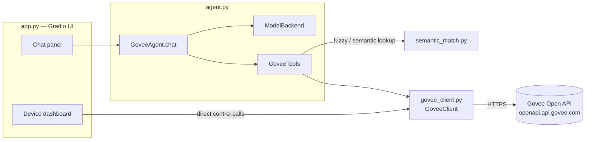
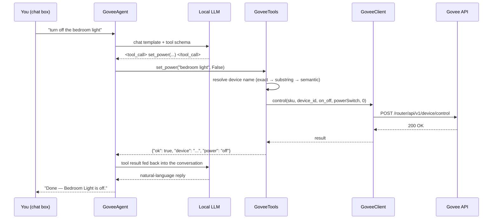

# Govee AI Assistant

A local dashboard and chat assistant for [Govee](https://www.govee.com/) smart
home devices. A [Gradio](https://www.gradio.dev/) web UI shows live device
status and lets you control devices directly, while a **locally-run LLM**
acts as a tool-calling agent that can look up and control the same devices
through natural language — no data leaves your machine except the Govee API
calls themselves.

```
"turn off the christmas lights and set the bedroom lamp to 30% warm white"
```

The assistant resolves device names (including fuzzy/semantic matches),
checks what each specific device actually supports, and calls the Govee API
directly — all through a small, dependency-light Python stack.

## Contents

- [Why this exists](#why-this-exists)
- [Features](#features)
- [Architecture](#architecture)
- [How each component works](#how-each-component-works)
  - [govee_client.py](#govee_clientpy)
  - [semantic_match.py](#semantic_matchpy)
  - [agent.py](#agentpy)
  - [app.py](#apppy)
  - [Tests and CLI utilities](#tests-and-cli-utilities)
- [Project structure](#project-structure)
- [Installation](#installation)
- [Configuration](#configuration)
- [Running it](#running-it)
- [Supported controls](#supported-controls)
- [Testing](#testing)
- [Troubleshooting](#troubleshooting)
- [Roadmap](#roadmap)
- [License](#license)

## Why this exists

Govee's own app and cloud integrations work fine, but there's no
official way to say *"turn off whatever's on in the bedroom"* and have it
figure out what that means. This project adds that layer, entirely locally:

- **No cloud LLM.** The model that interprets your requests runs on your own
  GPU (or CPU/OpenVINO as a fallback) — only the Govee API calls themselves
  leave the machine.
- **Capability-aware, not hardcoded.** Every device advertises its own
  capabilities (a fan and a light strip support completely different
  controls); the tool layer reads that per-device instead of assuming a
  fixed feature set.
- **Forgiving about names.** "the wifi sensor" or "the lamp in the bedroom"
  can resolve to the right device even without an exact name match — but it
  won't guess between two genuinely similar devices.

## Features

- **Live dashboard** — every device on your account, current state
  (power / brightness / color temp / online status / sensor readings),
  refreshed on load, on demand, and after each chat turn.
- **Natural-language control** — a local LLM plans and executes Govee API
  calls via a small, explicit tool set (power, brightness, RGB color, color
  temperature, scenes, toggles, fan speed).
- **CUDA → OpenVINO → CPU fallback** — automatically loads the model on
  whatever hardware is available, no manual configuration required.
- **Semantic device/scene matching** — a lightweight local embedding
  model resolves descriptive or approximate names when an exact match
  isn't found, and stays conservative when a request is genuinely
  ambiguous rather than guessing.
- **Automatic unit correction** — Govee's sensor API reports temperature
  in Fahrenheit with no unit field; this is normalized to Celsius once, at
  the source.
- **Fully offline-testable** — the device-resolution and tool-dispatch
  logic, and the entire Gradio UI wiring, can be tested with zero network
  calls and zero model loading via fake/stub doubles.
- **Defensive by design** — every tool call is wrapped so a bug in one
  tool can't crash the whole conversation; capability checks return a
  clear error instead of guessing at what a device can do.

## Architecture



Each layer only knows about the one below it: `app.py` never talks to the
Govee API directly except through `GoveeClient`, and `agent.py` never talks
to Gradio at all. This is also why the whole thing is testable without a
network connection or a loaded model — every layer's dependency is a
[`typing.Protocol`](https://docs.python.org/3/library/typing.html#typing.Protocol)
(a structural interface), so a fake object with the right methods can stand
in for the real thing in tests.

### Request flow (chat)



If the model isn't confident about a device or its capabilities, the system
prompt instructs it to call `list_devices` or `get_device_state` first
rather than guess — the tool schema and prompt work together on this.

## How each component works

### govee_client.py

The Govee API wrapper. A thin, typed client around Govee's **Open API v2**
(the current capability-based API, not the older flat turn/brightness/color
model).

| | |
|---|---|
| Base host | `https://openapi.api.govee.com` |
| Auth | `Govee-API-Key` header |
| Rate limit | 10,000 requests / account / day |

Key pieces:

- **`Capability`** — a dataclass mirroring one entry from Govee's device
  capability list (`type`, `instance`, and a `parameters` blob describing
  whether it's an `ENUM`, `INTEGER` range, or nested `STRUCT`). Exposes
  `.options` and `.value_range` as convenience properties.
- **`Device`** — a dataclass for one physical device, holding its full raw
  capability list plus `.capability(type, instance)` and `.has(type,
  instance)` lookups. This is what lets every other layer ask "can this
  specific device do X?" instead of assuming.
- **`GoveeClient`** — the actual HTTP client:
  - `list_devices()` — `GET /router/api/v1/user/devices`, cached after the
    first call (pass `force_refresh=True` to bypass).
  - `get_state(sku, device_id)` — `POST /router/api/v1/device/state`,
    returns a flattened `{instance: value}` dict. **Converts
    `sensorTemperature` from Fahrenheit to Celsius here**, since Govee's
    API returns it unlabeled and in Fahrenheit — every consumer downstream
    gets Celsius automatically.
  - `control(...)` — the low-level `POST /router/api/v1/device/control`
    call; `set_power`, `set_brightness`, `set_color_rgb`, `set_color_temp`,
    and `set_scene` are typed convenience wrappers over it. `set_brightness`
    and `set_color_temp` clamp out-of-range values to the device's actual
    supported range before sending.
  - Raises `GoveeAPIError` (and the `GoveeRateLimitError` subclass for
    HTTP 429) with the parsed error message from Govee's response body.
- **`verify=`** constructor parameter accepts a path to a corporate CA
  bundle, for networks behind a TLS-inspecting proxy.

### semantic_match.py

Fuzzy name matching. A small, dependency-isolated module used as a
**fallback**, not a replacement, for exact/substring name matching
elsewhere in the project.

- Uses [`sentence-transformers`](https://www.sbert.net/)'
  `all-MiniLM-L6-v2` (~90MB) on CPU — this is orders of magnitude smaller
  than the reasoning model, so it doesn't need the CUDA/OpenVINO fallback
  chain; it's loaded once, lazily, on first use.
- **`best_match(query, candidates, threshold=0.45, margin=0.03)`** embeds
  the query and every candidate string, and returns the closest match only
  if it clears the similarity threshold *and* beats the runner-up by a
  clear margin. If two candidates are close enough to be genuinely
  ambiguous, it returns `None` rather than guessing — the caller is
  expected to fall through to an error asking for clarification.
- `encode_fn` is injectable, which is what makes this fully unit-testable
  without downloading the real model (see [Testing](#testing)).

### agent.py

The local LLM and tool-calling agent — the core of the "AI" part. Three
main pieces:

**`ModelBackend`** — loads `unsloth/Qwen3-4B-Instruct-2507` with a
three-step fallback:

1. **CUDA**, via `transformers`, if `torch.cuda.is_available()`.
2. **OpenVINO** (`optimum-intel`'s `OVModelForCausalLM`), exported once and
   cached on disk under `ov_cache/` — every subsequent run loads the cached
   IR instead of re-exporting. Optional INT8 weight compression via `nncf`
   (`ModelBackend(int8=True)`).
3. **Plain CPU** via `transformers`, as a last resort.

   Whichever backend loads, `.generate()` and the tokenizer expose the same
   interface, so the tool-calling loop below doesn't need to know which one
   is active.

**`GoveeTools`** — the actual functions the LLM is allowed to call, each
wrapping `GoveeClient` with device resolution and capability checking:

| Tool | What it does |
|---|---|
| `list_devices` | Lists every device and what it can be controlled for |
| `get_device_state` | Current state of one device |
| `set_power` | Turn a device on/off |
| `set_brightness` | Set brightness 1–100% |
| `set_color_rgb` | Set RGB color |
| `set_color_temp` | Set white color temperature (Kelvin) |
| `set_scene` | Activate a named preset scene |
| `set_toggle` | Turn a named toggle feature on/off (e.g. oscillation) |
| `set_fan_speed` | Set a fan to low/medium/high |

Device names are resolved in three stages inside `_find_device`: **exact
match → unique substring match → semantic match** (via `semantic_match.py`).
An ambiguous or unresolvable name raises `DeviceNotFoundError`, which the
agent surfaces back to the model as a normal tool error rather than
crashing.

`set_fan_speed` is worth calling out specifically: Govee's `work_mode`
capability schema varies a lot between devices — some report named speed
levels ("Low"/"Medium"/"High"), others just plain numbered gears (1–8) with
no names at all. The implementation handles both shapes (and a flat integer
range) generically, mapping low/medium/high positionally when there's
nothing to match by name.

**`build_tool_schema()`** describes all nine tools in OpenAI-style function-schema
JSON. Qwen3's chat template supports this natively — passing `tools=` to
`tokenizer.apply_chat_template(...)` makes the model emit
`<tool_call>{"name": ..., "arguments": {...}}</tool_call>` blocks, which
`agent.py` extracts with a regex (`TOOL_CALL_RE`) and dispatches. No
external agent framework is needed for this single, well-defined local
tool surface.

**`GoveeAgent`** ties it together — `chat(user_message, history)` runs a
bounded loop (`max_tool_iters`, default 5): generate → check for tool calls
→ execute them → feed results back in → repeat until the model produces a
plain-text reply or the iteration budget runs out. `_call_tool` catches
*any* exception a tool raises (not just the expected ones) and turns it
into an error message for the model, so a bug in one tool can't take down
the whole conversation.

### app.py

The Gradio dashboard and chat UI. A two-column
[`gr.Blocks`](https://www.gradio.dev/docs/gradio/blocks) app, built by
`build_ui(client, agent)`:

- **Left column — dashboard.** One card per device (built dynamically from
  the real device list at startup), each showing a formatted state summary
  and, if the device supports it, a power toggle button and/or a brightness
  slider that call `GoveeClient` **directly** — bypassing the LLM entirely
  for quick manual control.
- **Right column — chat.** A standard chatbot wired to `GoveeAgent.chat`,
  with the tool-aware conversation history kept in `gr.State` separately
  from the display-only chat log.
- State refreshes on page load, on a manual refresh click, after any
  dashboard control action, and after every chat turn — deliberately not
  on a timer, to stay well under Govee's daily rate limit.
- `GRADIO_ANALYTICS_ENABLED` is disabled by default (avoids extra outbound
  calls, relevant on restricted networks).

`build_ui`'s parameters are typed against local `Protocol` classes
(`ClientLike`, `AgentLike`) describing only the methods actually used,
rather than the concrete `GoveeClient`/`GoveeAgent` classes — this is what
lets `test_app_build.py` build the entire UI against fake, no-network,
no-model stand-ins and still pass static type checking.

### Tests and CLI utilities

| File | Purpose | Needs network/model? |
|---|---|---|
| `test_govee.py` | Lists your real devices, capabilities, and state | Yes (Govee API only) |
| `agent_cli.py` | Interactive terminal chat loop against the real agent | Yes (Govee API + local model) |
| `test_tools_offline.py` | Exercises device resolution, capability checks, clamping, fan-speed schema handling, and semantic matching against **fake** devices | No |
| `test_app_build.py` | Builds the entire Gradio `Blocks` graph against a fake client and a stub agent, without launching a server | No |

The two offline test files are the fast feedback loop — run them after any
change to `agent.py` or `app.py` before touching the real account or
waiting for the model to load.

## Project structure

```
Govee AI Assistant/
├── govee_client.py         # Govee Open API wrapper
├── semantic_match.py        # Embedding-based fuzzy name matching
├── agent.py                 # ModelBackend, GoveeTools, GoveeAgent
├── app.py                   # Gradio dashboard + chat UI
│
├── test_govee.py            # Smoke test: list real devices/state
├── agent_cli.py              # Terminal chat against the real agent
├── test_tools_offline.py    # Offline logic tests (no network/model)
├── test_app_build.py        # Offline Gradio build test (no network/model)
│
├── requirements.txt          # Core deps (Govee client only)
├── requirements-agent.txt    # + local LLM / embedding deps
├── requirements-app.txt      # + Gradio
├── .env.example              # GOVEE_API_KEY template
└── README.md
```

## Installation

Requires **Python 3.10+**.

```bash
git clone <this-repo>
cd "Govee AI Assistant"

python -m venv .venv
source .venv/bin/activate      # Windows: .venv\Scripts\activate

pip install -r requirements.txt          # Govee client only
pip install -r requirements-agent.txt    # + local LLM agent
pip install -r requirements-app.txt      # + Gradio dashboard
```

If you have an NVIDIA GPU, install the CUDA build of `torch` matching your
driver instead of the default CPU build — see the comment at the top of
`requirements-agent.txt`.

## Configuration

```bash
cp .env.example .env
```

Then edit `.env` and add your key:

```
GOVEE_API_KEY=your-govee-api-key-here
```

Get one from the **Govee Home app → Profile → Settings (gear icon) → Apply
for API Key**. It's emailed to you, usually within a day.

**Behind a corporate/TLS-inspecting proxy?** Pass a CA bundle explicitly:

```python
GoveeClient(verify="/path/to/corp-ca-bundle.pem")
```

or set the `REQUESTS_CA_BUNDLE` environment variable.

## Running it

```bash
# 1. Confirm the API key and list your devices
python test_govee.py

# 2. Try the agent from a terminal (no UI)
python agent_cli.py

# 3. Launch the full dashboard
python app.py
```

`app.py` prints a local URL (typically `http://127.0.0.1:7860`) once it's
ready. **First run will be slow** — it downloads the ~4B-parameter model
(a few GB) and, if no CUDA GPU is available, exports it to OpenVINO IR
(cached under `ov_cache/` for every run after that).

## Supported controls

Not every device supports every control — `GoveeTools` checks each
device's real capability list before acting and returns a clear error
(listing what *is* available) if you ask for something unsupported.
Typical capabilities across common Govee device types:

| Device type | Power | Brightness | Color / temp | Scenes | Other |
|---|:-:|:-:|:-:|:-:|---|
| Light / bulb / strip | ✅ | ✅ | ✅ | ✅ | segments, music mode (varies by model) |
| Fan | ✅ | — | — | — | oscillation toggle, gear-based speed |
| Plug / socket | ✅ | — | — | — | — |
| Thermometer / sensor | — | — | — | — | read-only temperature (°C) / humidity |

## Testing

```bash
# Fast, offline, no model or network required:
python test_tools_offline.py
python test_app_build.py
```

These use fake `GoveeClient`/agent stand-ins (`FakeGoveeClient`,
`DummyAgent`) built against the same `Protocol` interfaces the real classes
satisfy, so they validate real logic — device resolution, capability
checks, value clamping, fan-speed schema handling, semantic-match
fallbacks, and the entire Gradio wiring — without ever touching the
network or loading a multi-gigabyte model.

If you have [`pyright`](https://github.com/microsoft/pyright) installed
(the engine behind VS Code's Pylance), you can type-check the whole project
the same way an editor would:

```bash
pip install pyright
pyright *.py
```

## Troubleshooting

- **SSL / certificate errors on a corporate network** — see
  [Configuration](#configuration) above; pass a CA bundle or set
  `REQUESTS_CA_BUNDLE`.
- **`429` errors from the Govee API** — you've hit the 10,000
  requests/account/day limit. The dashboard only polls state on load,
  manual refresh, and after actions/chat turns by design, so this
  shouldn't happen under normal use.
- **First launch is slow / seems to hang** — expected on the very first
  run while the model downloads and (on non-CUDA machines) exports to
  OpenVINO; subsequent runs use the cache and are much faster.
- **A device won't respond to a control command** — ask the agent to
  `get_device_state` first, or run `test_govee.py`, to confirm the device
  is online and check its exact capability list; not every device supports
  every control.

## Roadmap

- [ ] Background/async model loading so the dashboard UI isn't blocked on
      startup while the model loads.
- [ ] Periodic auto-refresh on a timer (currently refresh-on-action only).
- [ ] Richer device cards (color swatches, scene pickers) in the dashboard.
- [ ] Packaging for easier distribution.

## License

No license has been chosen for this project yet — add a `LICENSE` file
(e.g. MIT, Apache 2.0) before treating it as open source in practice.
